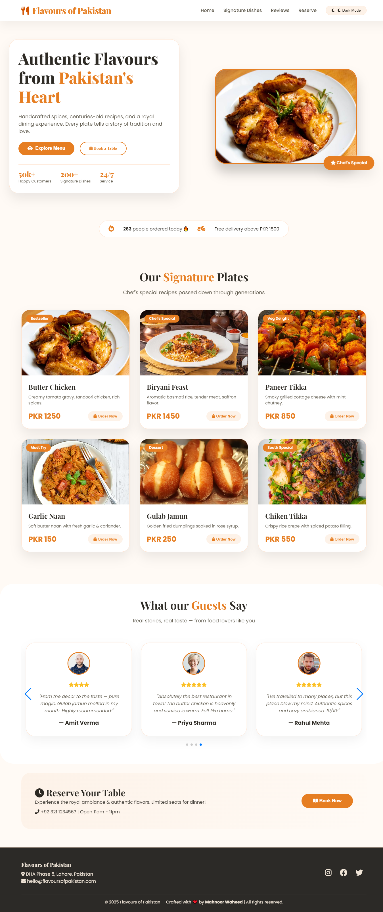
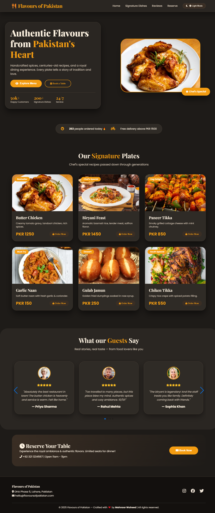

# 🍽️ Flavours of Pakistan

✨ A modern, visually rich food website inspired by the vibrant cuisine of Pakistan.
Built with a focus on smooth animations, interactive UI, and an engaging user experience.

---

## 🚀 Highlights

* 🎞️ **Interactive Slider (Swiper.js)** for featured dishes
* 🌙 **Dark & Light Mode** with smooth toggle
* 📱 **Fully Responsive Design** (Mobile + Tablet + Desktop)
* ✨ **Smooth Animations & Transitions**
* 🍛 Beautiful showcase of Pakistani cuisine
* 🎨 Clean, modern & user-friendly interface

---

## 🛠️ Tech Stack

* HTML5
* CSS3
* JavaScript
* Swiper.js

---

## 🎯 Key Sections

* 🔥 Hero Section 
* 🍽️ Featured Dishes
* 🧭 Food Categories
* 📖 Testimonial Section with slider
* 📩 Footer

---

## 🌐 Live Demo

👉 *Add your deployed link here*

---

## 📸 Preview

### 🌞 Light Mode

### 🌙 Dark Mode

---

## 💡 What Makes It Special?

This project is not just a static website — it focuses on **user experience and visual storytelling**.
The combination of responsive layout, interactive sliders, and theme switching creates a modern web feel.

---

## 🚧 Future Improvements

* 🛒 Add cart system
* 🔐 User authentication
* ⚡ Backend integration
* ❤️ Favorite / wishlist feature

---

## 👩‍💻 Author

**Mahnoor Waheed**
Frontend Developer passionate about building interactive and aesthetic web interfaces.

---

## ⭐ Show Some Love

If you like this project, don’t forget to ⭐ the repo!
